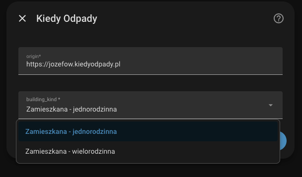
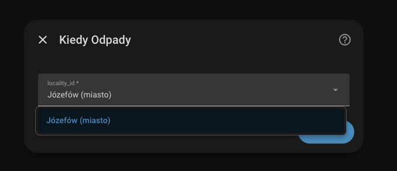
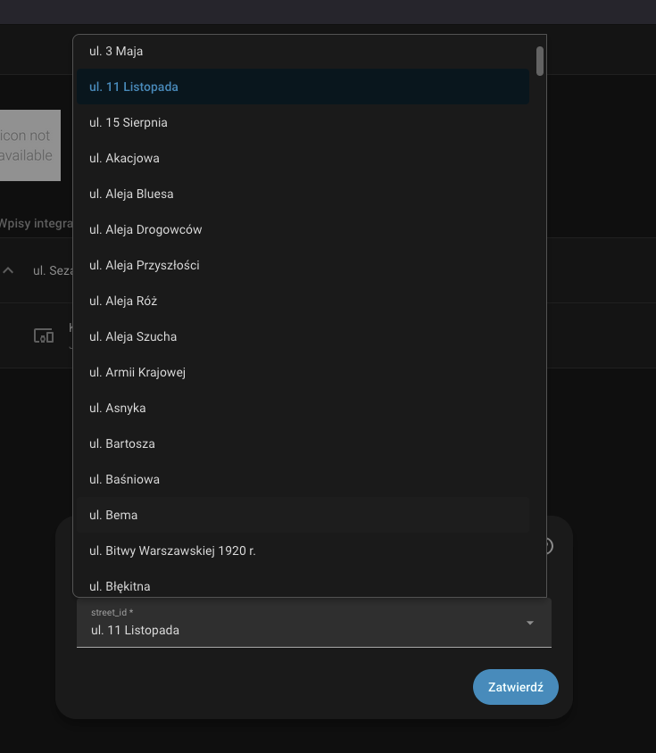
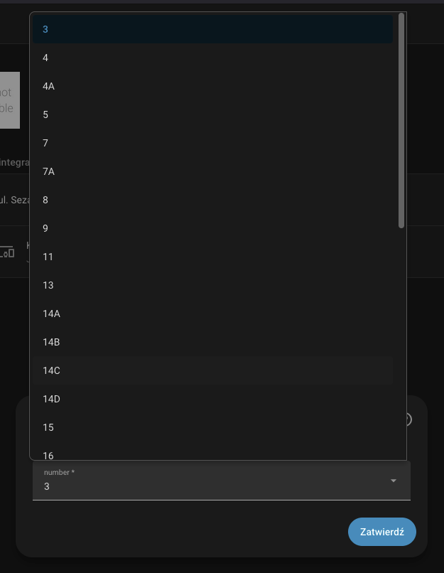
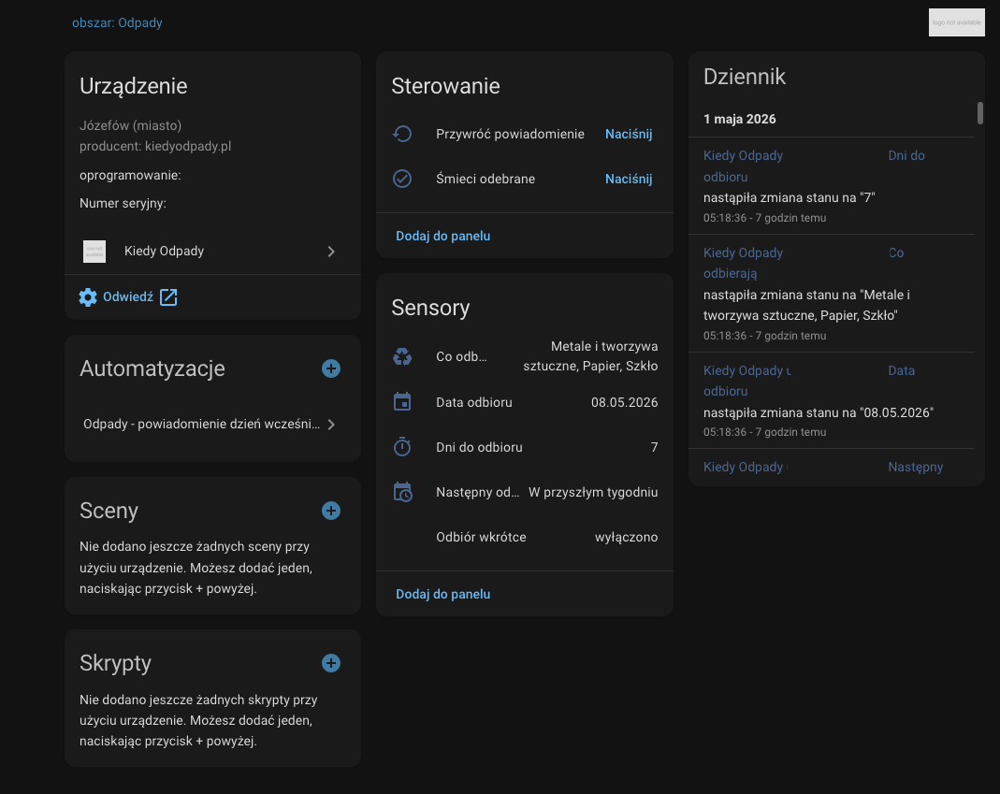

# Opis

Integracja pobierająca z [jozefow.kiedyodpady.pl](https://jozefow.kiedyodpady.pl/) informacjie o terminach i typach odbioru odpadów

# Konfiguracja dodatku:
## Dodanie niestandardowego repo hacs:

[Dodaj repozytorium do HACS](https://my.home-assistant.io/redirect/hacs_repository/?owner=KapatPL&repository=kiedyodpady&category=integration)

## Konfigurowanie integracji
- Wybieramy typ zabudowy

- Masto ustawiamy na Jozefów 

- Wybieramy adres odbioru odpadów

- Wybieramy numer budynku

- Masto ustawiamy na Jozefów 

